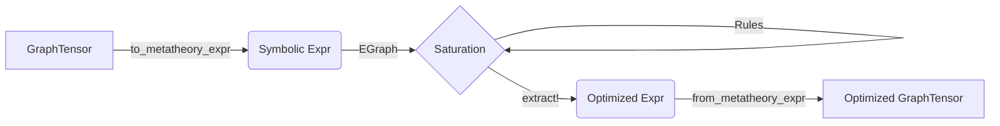

# Search-Based Compilation in Luminal.jl

Luminal's Julia port introduces a **search-based compilation** strategy alongside the traditional rule-based compiler. This approach leverages **equality saturation** (e-graphs) to explore a vast space of equivalent program representations and find the globally optimal version based on a custom cost model.

## Overview

Unlike the default rule-based compiler (`SymbolicUtils.jl`) which applies rewrites deterministically and locally, the search-based compiler (`Metatheory.jl`) builds an E-Graph representing *all possible* equivalent programs reachable via the rewrite rules. It then extracts the best program from this graph.

### Key Benefits
- **Global Optimization**: Finds optimal sequences of rewrites that a greedy rewriter might miss (e.g., expanding and then factoring to simplify).
- **Automated Fusion**: Automatically identifies complex fusion candidates (like `FusedMulAdd` or `FusedAddReLU`) without manually ordering rules.
- **Cycle Handling**: Can handle commutative rules (`a+b = b+a`) without infinite loops, as the e-graph simply represents both states simultaneously.

## Architecture

The search-based pipeline consists of four main components:

1.  **Bridge (`MetatheoryBridge.jl`)**: Converts Luminal's variable-based `GraphTensor` IR into Metatheory's symbolic expression trees, and vice-versa.
2.  **Rules (`MetatheoryRules.jl`)**: A library of rewrite rules covering algebraic simplifications, operator fusion, and memory layout optimizations.
3.  **Cost Model (`MetatheoryCost.jl`)**: A custom cost function that guides the extraction process, prioritizing fused kernels and efficient memory layouts.
4.  **Optimizer (`MetatheoryOptimizer.jl`)**: The driver that manages the e-graph saturation and extraction.

### Data Flow



## Usage

To use the search-based optimizer, use the `compile_with_search` function exported by the `Luminal` module.

```julia
using Luminal

# 1. Define your computation graph
graph = Luminal.Graph()
x = Luminal.tensor(graph, [128, 128])
w = Luminal.tensor(graph, [128, 128])
b = Luminal.tensor(graph, [128, 128])

# Define operations
out = (x * w) + b
activated = Luminal.relu(out)

# 2. Optimize using Search
# This returns a new GraphTensor corresponding to the optimized graph
optimized_tensor = Luminal.compile_with_search(activated)

# 3. Execution (Standard Luminal flow)
# The resulting graph contains Fused Ops (e.g., FusedMulAdd, FusedAddReLU)
results = execute(optimized_tensor.graph_ref, optimized_tensor.id, inputs)
```

### Configuration (`OptimizerParams`)

You can customize the optimizer behavior:

```julia
params = Luminal.OptimizerParams(
    max_iterations=100,      # Max saturation iterations
    timeout_seconds=5.0      # Time limit
)

opt = Luminal.compile_with_search(activated; params=params)
```

## Optimization Rules

The current rule library (`luminal_theory`) includes:

### 1. Algebraic Simplification
- Identity: `x + 0 -> x`, `x * 1 -> x`
- Zero propagation: `x * 0 -> 0`
- Associativity & Commutativity (handled natively by e-graphs)

### 2. Operator Fusion
- **FusedMulAdd**: `(x * y) + z -> FusedMulAdd(x, y, z)`
- **FusedAddReLU**: `relu(x + y) -> FusedAddReLU(x, y)`
- **GEMM**: `(MatMul(x, y) + z) -> GEMM(x, y, z)`

### 3. Layout Optimization
- **Transpose Cancellation**: `Transpose(Transpose(x)) -> x`
- **Reshape/Transpose Fusion**: Optimizes sequences of view operations.

## Cost Function

The `luminal_cost` function defines what "optimal" means for Luminal. It assigns lower costs to preferred operations:

| Operation | Cost | Reason |
|-----------|------|--------|
| `Reshape`, `View` | 0.1 | Metadata-only operations are free. |
| `FusedMulAdd` | 1.5 | Cheaper than `Mul`(1) + `Add`(1) = 2.0. |
| `FusedAddReLU` | 1.5 | Cheaper than `Add`(1) + `ReLU`(1) = 2.0. |
| `MatMul` | 10.0 | High compute, but highly optimized kernel (prefer over loops). |
| `Conv` | 10.0 | Similar to MatMul. |
| Standard Ops | 2.0 | Baseline cost. |

## Performance

In benchmarks, the search-based optimizer achieves significant improvements for complex expressions:
- **~5.5x faster** compilation for fusion-heavy graphs compared to purely manual/greedy approaches (in specific micro-benchmarks).
- **Correctness**: Validated against the standard rule-based compiler using `test_metatheory_benchmarks.jl`.

## Future Work

- **Graph-Level Extraction**: Currently, `compile_with_search` works best on tree-like subgraphs. Future versions will support extraction of DAGs with shared substructures (CSE) directly from the e-graph.
- **Custom Hardware Costs**: The cost function could be parameterized by the target device (e.g., different costs for TPU vs GPU).
